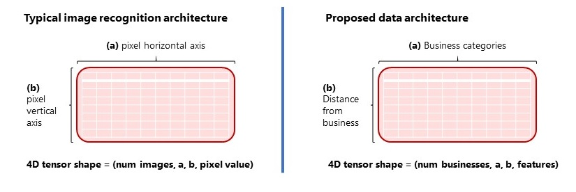
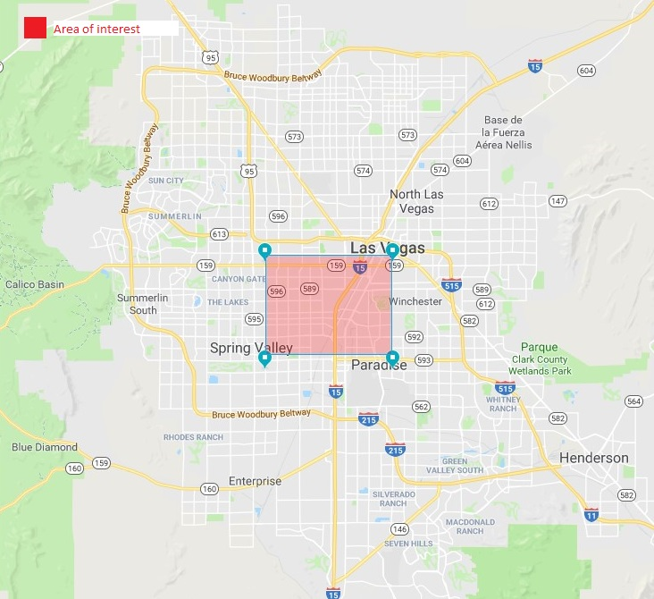
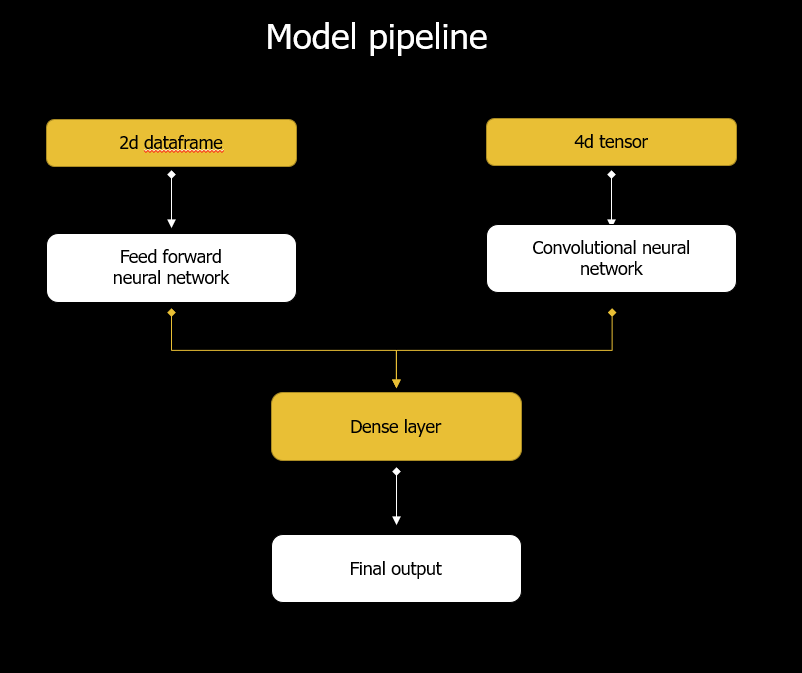

<br>
<br>
<br>
<br>
<br>
<br>

# Readme
**Author: Rodolfo Flores Mendez**
<br> May 2019 | Chicago, IL.

This repository contains the capstone project for the **Data Science Immersive Bootcamp** of **[General Assembly](https://generalassemb.ly/?&where=chicago&topic=&mkt_account_id=1056949875&mkt_campaign_id=691778555&mkt_ad_group_id=35193802309&mkt_device_type=c&mkt_keyword=%2Bgeneral%20%2Bassembly&mkt_matchtype=b&mkt_placement=&mkt_ad_id=155680786031&mkt_network=g&mkt_target_id=kwd-48819265686&mkt_feed_item_id=&utm_source=google&utm_medium=paid-search-bra&utm_campaign=TS:TX:BRA:CHI:BR:GeneralAssembly&utm_content=campus-lead-lander&utm_term=%2Bgeneral%20%2Bassembly&gclid=Cj0KCQjwzunmBRDsARIsAGrt4muPl97dktXwkioaJJasy6OeI-caw7CQzlLUAJ2_KMMnYKt-B34pm28aAkITEALw_wcB)**. It was developed as part of the coursework for **cohort \#7** at the city of **Chicago**.

## Table of contents
- [Project overview](#po)
- [Installation](#ins)
- [Data sources](#ds)
- [Proposed data architecture](#pda)
- [Area of interest](#aoi)
- [Final model](#fm)
    - Description
    - Code
- [Future iterations](#fi)
- [Additional resources](#adr)
- [Links to notebooks](#ltn)
    - Data extraction
    - Pre-processing review dataset

<br>

>**Project overview:<a id="po"></a>**  <br><br> While Convolutional Neural Networks (CNN's) are typically used for image recognition problems, this project explores the use of CNN's on an unconventional data architecture to improve accuracy on instances of limited information. The proposed architecture includes businesses, "distances" (or "radius of influence"), "business categories", and features from the Yelp Academic Dataset as dimensions of the 4D tensor fed into the CNN. <br><br> The model attempts to classify businesses between "permanently closed" and "open" based on benchmarks with neighbouring businesses and the proposed data architecture.<br><br> The final model used is a multi input model that combines a feed forward neural network and a convolutional neural network. This approach adds layers of complexity to the data structure in hopes that the model picks up in dimensional patters that 2D data architectures would not. <br><br> Overall, the use of a more complex data structure marginally increased overall accuracy. Comparatively speaking, the proposed model pipeline performed better than optimized Random Forests and Support Vector machines.


## Installation <a id="ins"></a>
The following libraries are requiered to execute the code contained in this repository.

```python
# Data handling, time and distance, combiantions, modelling and language processing
numpy, pandas, json, utm, time, itertools, sklearn, keras, tensorflow, regex, textblob, nltk, gensim
```

Verify that the most up to date version of the libraries mentioned above have been installed in your computer. For a guideline on python installation of modules please refer to the __[official documentation](https://docs.python.org/3/installing/)__.

## Data sources <a id="ds"></a>
Data used for this project comes from the **[Yelp Academic Dataset](https://www.yelp.com/dataset/challenge)** from 2019. Raw json files can be downloaded directly from Yelp's web page. Due to size constraints they were not included in this repository.

## Proposed data architecture <a id="pda"></a>

>The thesis behind the implementation of an unconventional data architecture is that, on situations where data is limited, adding layers of complexity will increase accuracy. <br><br> The data that can be retrieved from **[Yelp's API](https://www.yelp.com/developers)** and the **Academic Dataset** is limited and does not provide a significant amount of information regarding the reasons behind a business closure. Features such as "stars" or "rating", number of checkins, etc. do not provide a robust explanatory power on their own. <br><br> Nevertheless, a reasonable workaround to this limitation is to compare a given business against its neighboring competitors, under the assumption that low performing businesses relative to surrounding businesses are more likely to close. This approach has the benefit to consider within it the variations on business attributes by geography, distance, and business category, which might problematic on a 2D model.   

>**Proposed data architecture as compared to traditional CNNs |** Image representation 



>As shown on the image above, we attempt to achieve this by creating a parameter grid for each business, where: <br><br> - **(a)** the ***y*** axis of the grid relates to distances from the target business. The center of the grid repsents the smallest distance (radius), and it expands north and south as you approach the edges. <br><br> - **(B)** the ***x*** axis represents different business categories. The center of the grid relates to the same business category as the target business, as you approach the edges of the grid the similarity of such categories with the target business decreases. <br><br> - **(c)** the intersect of the ***y*** and ***x*** axis is comprosed of an array of features. Each element of the array (feature) is computed as the difference between the target business's measurement and the average of the surrounding/neighbouring businesses that fit such criteria (distance and category) - *we refer to this computation as "benchmarking"* -.

Below, an image representation of the specific data architecture used for this project as described above:

**Example 3D tensor for a target business | proposed data architecture**


## Area of interest <a id="aoi"></a>
For practical purposes we carried out this analysis on a densley populated business area. Running the script over a larger geographical area was beyond the computing capabilities and resources at hand as of the moment of developing this project. 

The area of interest chosen was the "Las Vegas" strip, bounded by the following geographical coordinates (Lats(36.092239,36.159071),Longs(-115.234375,-115.136185)).

**Image representation of the selected "area of interest" in Las Vegas Strip**



<br>
 
Distances were calculated with the Euclidean distance based on UTM for computational efficiency. Due to the size of the area of influence this calculation did not affect significantly the accuracy of distance. Nevertheless, in future iterations it would be reccomended to take into account more accurate distance measurements, speacially as the area of interest increases in size.

## Final model <a id="fm"></a>
For a detailed discussion on the structure of the final model please refer to the ppt presentation attahced to this repository and to the **[Modelling notebook](#Modelling_notebook.ipynb)**.

Brief model description: The final model considers the combination of two neural networks, a convolutional neural network that uses as an input the proposed architecture presented above, and a feed forward neural network that uses as an input a 2D dataframe. 

The advantage of this approach is to add layers of complexity to the data structure and hope that the model picks up in dimensional patters that 2D data architectures would not.

**Image representation | Model structure**


**[Extract | Final model code]**

```python
#Define inputs
inputA = Input(shape=Xffn_train[1].shape)
inputB = Input(shape=Xcnn_train[1].shape)

#Define the FFN model based on the grid search parameters
x = Dense(32,activation='relu',kernel_regularizer=regularizers.l2(0.002),kernel_initializer = 'glorot_uniform')(inputA)
x = Dense(32,activation='relu',kernel_regularizer=regularizers.l2(0.002))(x)
x = Dropout(0.3)(x)
x = Dense(32,activation='relu')(x)
x = Dense(128,activation='relu')(x)
x = Dense(20,activation='relu',kernel_regularizer=regularizers.l2(0.002))(x)
x = Dense(64,activation='relu',kernel_regularizer=regularizers.l2(0.002))(x)
x = Dropout(0.3)(x)
x = Dense(32,activation='relu')(x)
x = Dense(32,activation='relu')(x)
x = Model(inputs = inputA, outputs = x)

#Define the CNN model based on the grid search parameters
y = Conv2D(filters = 4, kernel_size =(3,6), activation = 'relu', padding = 'Same',kernel_initializer='uniform',kernel_regularizer=regularizers.l2(0.002))(inputB)
y = Conv2D(filters = 32, kernel_size =8, activation = 'relu', kernel_regularizer = regularizers.l2(0.002), padding = 'Same')(y)
y = Dropout(0.3)(y)
y = Flatten()(y)
y = Dense(10,activation='relu')(y)
y = Dense(18,activation='relu')(y)
y = Dropout(0.3)(y)
y = Model(inputs = inputB, outputs = y)

#Combine the outputs of both networks
combined = concatenate([x.output,y.output])

z = Dense(18, activation='relu')(combined)
z = Dropout(0.3)(z)
z = Dense(10, activation='relu')(z)
z = Dense(1, activation = 'sigmoid')(z)

# z = Dense(2, activation='relu')(combined)
# z = Dense(1, activation = 'sigmoid')(z)

#Define model
model = Model(inputs = [x.input,y.input], outputs = z)

#Define optimizer
optimizer = 'Adam'

#Compile the model
model.compile(loss='binary_crossentropy',optimizer=optimizer,metrics=['acc'])

#Train the model
history = model.fit([Xffn_train,Xcnn_train],
                    ycnn_train,
                    validation_data = ([Xffn_test,Xcnn_test],ycnn_test),
                    epochs = 20,
                    batch_size = 128)
```
## Future iterations  <a id="fi"></a>
Use more data to train the model (basically related to limitations on computing power available):
- Use more bins/dimensions
- Increase the number of locations of interest
- Add and RNN to the model structure considering the same variables but segregated by distance and categories throughout time.

There is evidence to believe that the mixed model can improve accuracy.

## Additional resources <a id="adr"></a>
The reader might consider usefull to run some of the scripts outlined in this repository's notebooks on a cloud computing service. Some of the processes are computationally intensive for conventional laptop machines without a supported GPU.

We developed this code on a Deep learning AWS instance, and ran several processes on the background. We reccomend the reader to do so as well:

- **[AWS](https://aws.amazon.com)**. If the reader is unfamiliar on how to run processes on the background of an elastic computing service, [this blogpost](https://medium.com/@ro.flores.mendez/running-python-on-aws-for-machine-learning-using-audio-and-speech-recognition-while-you-are-gone-28909f1b462) discusses how to run processes on the background, on the context of another project, but applicable to this one.

## Links to notebooks <a id="ltn"></a>
The following hyperlinks reference to the jupyter notebooks containing the code for the complete project, requiered to run the final model as presented above.
- [Data extraction (from json to csv)](Data_extraction_json_to_csv.ipynb)
- [Pre-processing review dataset](Pre-processing_reviews.ipynb)
- [Data architecture](#Data_architecture.ipynb)
- [Modelling](#Modelling_notebook.ipynb)
